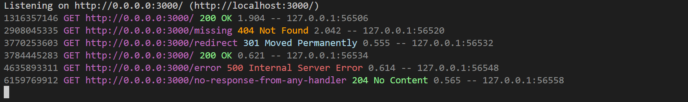

# 🦅 @trie/http-router

[](https://deno.land)
[](./LICENSE)
[](#)
[](https://www.typescriptlang.org/)

> A lightweight, and lightning fast router library for Deno.  
> Built for simplicity, extensibility, and modern Deno applications.

---

## ✨ Features

- 🌐 Minimal yet lightning fast HTTP routing
- ⚙️ Middleware support
- 🏆 Parameter, query and body parsing support
- 🏆 Basic request validation and filter spport
- 🏆 Basic, api-key, token, cookie, and JWT authentication spport
- 🏆 Pluggable render engine support
- 🏆 Prettier route definitions with collapse in mind
- 📄 Written in modern TypeScript
- ... and more

---

## 🎯 Quick Docs

Trie http-router handles routes using a trie to enable lightning fast url matching when handling incoming requests.

To start you create a new `Router` then define its routes and then serve it using the `handleRequest` method.

```ts
const mainRouter = new Router();
//...
Deno.serve({ port: 3000 }, router.handleRequest);
```

## 🚀 Quick Start

```ts
import { Router, staticFiles } from "@trie/http-router";

const mainRouter = new Router({
  log: { requests: requestLogger(console.log) },
});

mainRouter.handle("GET /")((pr) => pr.html("<h1>Hello world!</h1>"));

// set ["HEAD /", "HEAD /**", "GET /", "GET /**"] fallback handlers
mainRouter.fallback("HEAD|GET /,/**")([
  staticFiles({
    path: "public",
    eTag: true,
    cache: true,
    compressionTreshold: 8 * 2 ** 10, // 8Kb
    extensions: ["html"],
    indexFiles: ["index"],
  }),
]);

Deno.serve({ port: 3000 }, mainRouter.handleRequest);
```

```ts
mainRouter.handle("GET /user/:id")((pr) => pr.json({ userId: pr.params.id }));

mainRouter.handle("GET /|home|products|about:page")((pr) => {
  const page = pr.params.page || "home";
  return pr.render(page); // requires render engine setup
});
```

---

## ✨ `requestLogger` Preview



📝 **WHEN DEFINING THE ROUTES YOU CAN:**

> Set any number of handlers for a mix of methods and paths.

> Use `|` to separate methods like `HEAD|GET` and parameterized paths like `/|products|about:page` and `,` to separate paths like `/path-a,/path-b/res-c`. But you cannot use any other spaces other than to separate the methods from the paths like `GET /path/to/resource`.

> Use url parameters like `/user/:userId/posts/:postId`. Parameterized paths can be defined like `/apple|mango:param` and will be restricted to the given paths only, in this case `param` will only match when the path is `/apple` or `/mango`. To match the current path then add a `|` splitter anywhere in the parameterized path list like `/|products|about:page` or `/products||about:page` or `/products|about|:page`.

> Either provide a single handler or multiple handlers in an array. _\[Using array even for a single handler is recommended.\]_

> Register a handler function directly or using a setup function that returns a handler.

> Register already registered handlers to other paths by using `router.get*` in place of handlers.

**NOTE:** Route definition order does not matter. However an error will be thrown when path override occurs.

---

### 📍 Middlewares

A handler can be a middleware if it is ordered before another handler
and if it does not return a response (based on some conditions). If a handler returns a response then the rest of the handlers will not be called.

```ts
function middleware0(options): Handler<UserData> {
  // prepare the middleware here
  // ...
  // return the handler
  return (pr) => {
    if (!pr.request.headers.has("authorization"))
      return pr.end(StatusCode.Unauthorized);
  };
}

const middleware1 = (pr: ProRequest) => {
  console.log(pr.url.method, pr.url.pathname);
};

const handler = (pr) => pr.end(StatusCode.OK);

mainRouter.handle("PUT|PATCH /,/a,/b/c")([
  middleware0({
    /*...*/
  }),
  middleware1,
  //...
  handler,
]);
```

---

### 📌 Handlers

There are 5 types of handlers:

> **Filter**: The filter handlers are called first. Use them to filter requests. Eg. **_rate limits_** and **_access control (CORS)_**.

> **Hook**: The hook handlers are called second. Use them to hook into requests.
>
> **NOTE:** All matched hook handlers along the path trie will be called.
> eg: hook at `/api/**` will be called when handling `/api/user/...`

> **Handler**: The main handlers are called third. Use them to handle the requests.

> **Fallback**: The fallback handlers are called fourth after handlers,
> but only if no handler has returned a response so far.

> **Catcher**:
> The catch handlers are onnly called when uncaught errors are encountered during request handling. Use them to handle errors.

## 🏆 The `ProcessedRequest` type alias `ProRequest`

The `ProcessedRequest` class will be created when handling incoming requests and passed to handlers in subsequent calls.
It takes a `<UserData>` type template parameter which is used to extend the type to include custom properties. Eg. `type UserData = { session?: Session }`.

These are the defined methods:

Query and Body:

- `query ()`
- `body ()`

Cookies:

- `cookie (name, value, options?)`
- `expire (name, options?)`
- `expireAll (options?)`

Response Generators:

- `status (statusCode)`
- `end (statusCode?, noStatusText?)`
- `send (bytes?, statusCode?, contentType?)`
- `text (text?, statusCode?, contentType?)`
- `html (html?, statusCode?, contentType?)`
- `json (obj?, statusCode?, contentType?)`
- `render (filePath, locals?, statusCode?)`
- `redirect (toLocation, status?)`
- `forward (toLocation, status?)`

## 📢 Miscellaneous Imports

### Filters:

> `rateLimit` `accessControl` or `filter.*`

```ts
import { filter, rateLimit, accessControl } from "@trie/http-router";
```

### Handlers:

> `staticFiles` or `handle.*`

```ts
import { handle, staticFiles } from "@trie/http-router";
```

### Parsers:

> `parse.cookie`

```ts
import { parse } from "@trie/http-router";
```

### Validators:

> `query` `body` `content` `noQuery` `noContent` or `validate.*`

```ts
import {
  validate,
  query,
  body,
  content,
  noQuery,
  noContent,
} from "@trie/http-router";
```

### JWT:

> `JWT`

```ts
import { JWT } from "@trie/http-router";
```

### Auth:

> `auth` `basic` `apiKey` `bearerToken` `jsonwebtoken` `cookie`

```ts
import {
  auth,
  basic,
  apiKey,
  bearerToken,
  jsonwebtoken,
  cookie,
} from "@trie/http-router";
```

### Status Codes and Text

> `StatusText`, `StatusCode` `StatusCode1` `StatusCode2` `StatusCode3` `StatusCode4` `StatusCode5`

```ts
import {
  StatusText,
  StatusCode,
  StatusCode1,
  StatusCode2,
  StatusCode3,
  StatusCode4,
  StatusCode5,
} from "@trie/http-router";
```

### Errors:

> `RouterError` `HttpError`

```ts
import { RouterError, HttpError } from "@trie/http-router";
```

### Loggers

> `requestLogger`

```ts
import { requestLogger } from "@trie/http-router";
```

### Render Engines

> `PugEngine`

```ts
import { PugEngine } from "@trie/http-router/engines/render";
```

---

## 🖼️ Render Engines

Currently only Pug engine is implemented but you can make your own by implementing the abstract class `RenderEngine` which only has one abstract method `render`.

```ts
import { requestLogger, Router, staticFiles } from "@trie/http-router";
import { PugEngine } from "@trie/http-router/engines/render";

const mainRouter = new Router({
  log: { requests: requestLogger(console.log) },
  engines: {
    render: new PugEngine(
      { basedir: "pug", cache: true, pretty: false },
      { brand: "@trie/http-servers" }
    ),
  },
});

mainRouter.handle("GET /,products,services,about:page")([
  (pr) => {
    const path = pr.url.pathname || "index";
    return pr.render(path);
  },
]);
```

```pug
//- pug/index.pug
doctype html
html(lang="en")
  head
    title #{brand}
    meta(charset="UTF-8")
    meta(name="viewport", content="width=device-width, initial-scale=1.0")
  body
    header
      h1 #{brand}
    main
      p A lightweight, modular, and lightning fast router library for Deno.
    footer
      div &copy; #{new Date().getFullYear()} Natnael
```

---

## ⚙️ Auth Example

```ts
import { Router, StatusCode, staticFiles, auth } from "@trie/http-router";

type UserRole = "admin" | "user";
type User = { username: string; password: string; role: UserRole };
type UserData = { user?: User };

// Authentication middleware using basic Authorization header
function authenticate() {
  const users: Record<string, User> = {
    admin: {
      username: "admin",
      password: "admin",
      role: "admin",
    },
    user: {
      username: "user",
      password: "User124",
      role: "user",
    },
  } as const;

  return auth.basic<UserData>({
    credentials({ username, password }, pr) {
      const user = users[username];
      if (!user)
        return pr.json({ message: "unknown user" }, StatusCode.Unauthorized);
      if (user.password !== password)
        return pr.json({ message: "wrong password" }, StatusCode.Unauthorized);
      const { password: _, _user_ } = user;
      pr.user = _user_;
    },
  });
}

/* ROUTES /  router */
const mainRouter = new Router({
  log: { requests: requestLogger(console.log) },
});

/* ROUTES /api/user  userRouter */
const userRouter = new Router<UserData>();

// get user if authenticated
userRouter.handle("GET /")([
  authenticate(),
  (pr) => pr.json({ user: pr.user }),
]);

mainRouter.append("/api/user", userRouter);

/* SERVE */
Deno.serve({ port: 3000 }, mainRouter.handleRequest);
```

**HTTP tests using REST Client**

```http
GET http://localhost:3000/api/user HTTP/1.1
Authorization:Basic user:User124

---
HTTP/1.1 200 OK
content-type: application/json; charset=UTF-8
vary: Accept-Encoding
connection: close
content-length: 35
date: Fri, 13 Jun 2025 16:26:28 GMT

{
  "user": {
    "username": "user",
    "role": "user"
  }
}
```

```http
GET http://localhost:3000/api/user HTTP/1.1
Authorization:Basic user:user

---
HTTP/1.1 401 Unauthorized
content-type: application/json; charset=UTF-8
vary: Accept-Encoding
connection: close
content-length: 28
date: Fri, 13 Jun 2025 16:28:19 GMT

{
  "message": "wrong password"
}
```

---

## 📄 License

MIT © 2025 Natnael
See [LICENSE](/LICENSE) for details.

## 🪽 Thank You!

Dont forget to show your support by giving a star on [GitHub](https://github.com/nati-esh-zed/trie--http-router).
